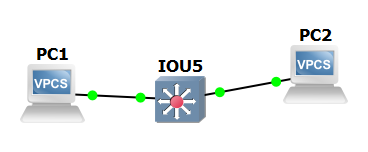
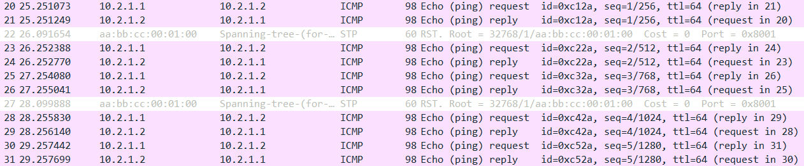
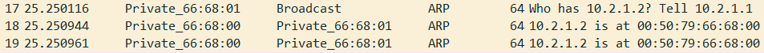
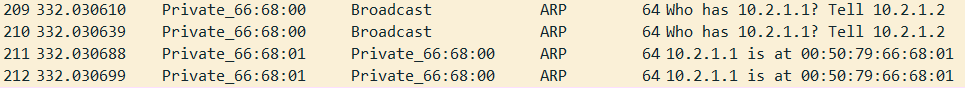
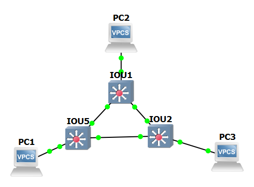
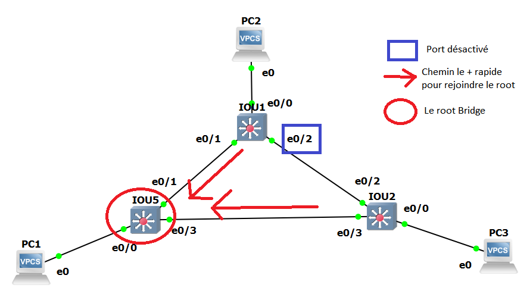
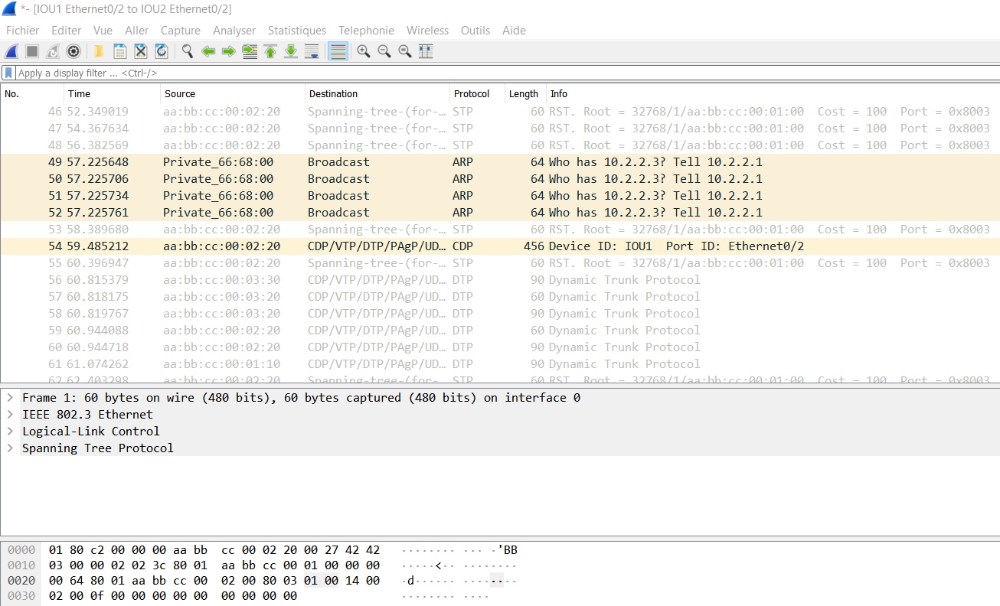
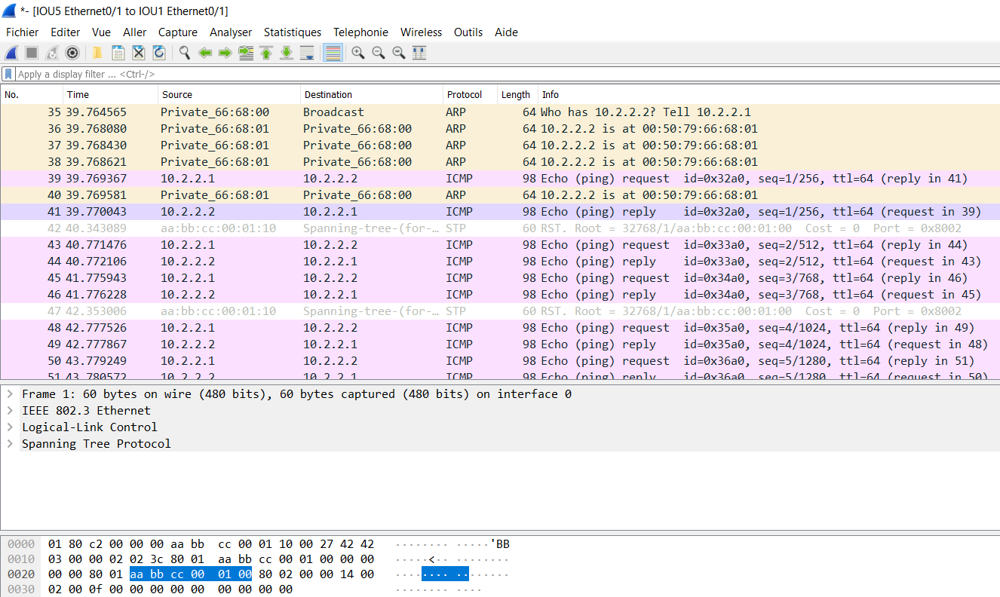
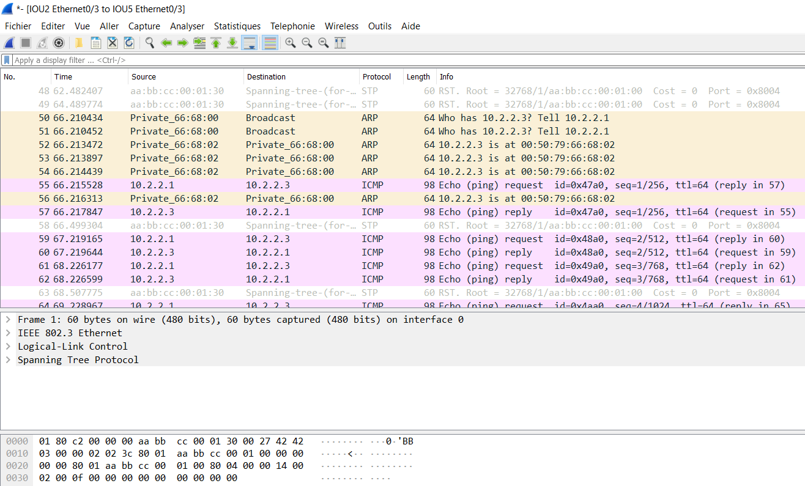
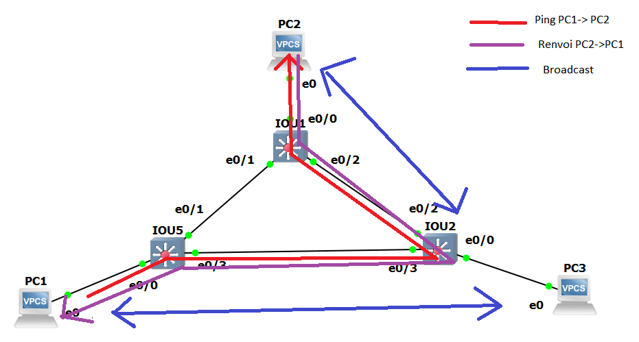

# TP2 : Network low-level, Switching

# I. Simplest setup

#### Topologie

```
+-----+        +-------+        +-----+
| PC1 +--------+  SW1  +--------+ PC2 |
+-----+        +-------+        +-----+
```

#### Plan d'adressage

Machine | `net1`
--- | ---
`PC1` | `10.2.1.1/24`
`PC2` | `10.2.1.2/24`

#### ToDo

> **Si vous lancez Wireshark, et que vous mettez des dumps/captures d'écran, précisez où vous avez lancé Wireshark (sur quel lien réseau/quelle machine et quelle interface)**

* 🌞 mettre en place la topologie ci-dessus



* 🌞 faire communiquer les deux PCs
  * avec un `ping` qui fonctionne
```bash
PC1> ping 10.2.1.2/24
84 bytes from 10.2.1.2 icmp_seq=1 ttl=64 time=0.224 ms
84 bytes from 10.2.1.2 icmp_seq=2 ttl=64 time=0.304 ms
84 bytes from 10.2.1.2 icmp_seq=3 ttl=64 time=0.358 ms
84 bytes from 10.2.1.2 icmp_seq=4 ttl=64 time=0.296 ms
84 bytes from 10.2.1.2 icmp_seq=5 ttl=64 time=0.358 ms

PC2> ping 10.2.1.1/24
84 bytes from 10.2.1.1 icmp_seq=1 ttl=64 time=0.408 ms
84 bytes from 10.2.1.1 icmp_seq=2 ttl=64 time=0.311 ms
84 bytes from 10.2.1.1 icmp_seq=3 ttl=64 time=0.336 ms
84 bytes from 10.2.1.1 icmp_seq=4 ttl=64 time=0.392 ms
84 bytes from 10.2.1.1 icmp_seq=5 ttl=64 time=0.298 ms
```

* déterminer le protocole utilisé par `ping` à l'aide de Wireshark

Le protocole est ICMP 


  * analyser les échanges ARP
    * utiliser Wireshark et mettre en évidence l'échange ARP entre les deux machines (`ARP Request` et `ARP Reply`)

    
    
    * corréler avec les tables ARP des différentes machines
```bash
PC1> show arp
00:50:79:66:68:00  10.2.1.2 expires in 114 seconds

PC2> show arp
00:50:79:66:68:01  10.2.1.1 expires in 111 seconds
```
* 🌞 récapituler toutes les étapes (dans le compte-rendu, à l'écrit) quand `PC1` exécute `ping PC2` pour la première fois
  * échanges ARP
  ```bash
  PC1 envoi une request en protocol ARP puis PC2 envoi une reply en protocol ARP.
  ```
  * échange `ping`
  ```bash
  PC1 envoi une request en protocol ICMP de type 8 et PC2 envoi une reply en protocol ICMP de type 0.
  ```
* 🌞 expliquer...
  * pourquoi le switch n'a pas besoin d'IP
  ```bash
  Le switch ne fait que rediriger les informations donc il n a pas besoin d IP.
  ```
  * pourquoi les machines ont besoin d'une IP pour pouvoir se `ping`
  ```bash
  Pour connaître le destinataire.
  ```

# II. More switches

#### Topologie

```
                        +-----+
                        | PC2 |
                        +--+--+
                           |
                           |
                       +---+---+
                   +---+  SW2  +----+
                   |   +-------+    |
                   |                |
                   |                |
+-----+        +---+---+        +---+---+        +-----+
| PC1 +--------+  SW1  +--------+  SW3  +--------+ PC3 |
+-----+        +-------+        +-------+        +-----+
```

#### Plan d'adressage

Machine | `net1`
--- | ---
`PC1` | `10.2.2.1/24`
`PC2` | `10.2.2.2/24`
`PC3` | `10.2.2.3/24`

#### ToDo

* 🌞 mettre en place la topologie ci-dessus


* 🌞 faire communiquer les trois PCs
  * avec des `ping` qui fonctionnent
```bash
PC1> ping 10.2.2.2/24
84 bytes from 10.2.2.2 icmp_seq=1 ttl=64 time=0.442 ms
84 bytes from 10.2.2.2 icmp_seq=2 ttl=64 time=0.549 ms
84 bytes from 10.2.2.2 icmp_seq=3 ttl=64 time=0.900 ms
84 bytes from 10.2.2.2 icmp_seq=4 ttl=64 time=0.449 ms
84 bytes from 10.2.2.2 icmp_seq=5 ttl=64 time=0.446 ms

PC1> ping 10.2.2.3/24
84 bytes from 10.2.2.3 icmp_seq=1 ttl=64 time=0.310 ms
84 bytes from 10.2.2.3 icmp_seq=2 ttl=64 time=0.502 ms
84 bytes from 10.2.2.3 icmp_seq=3 ttl=64 time=0.515 ms
84 bytes from 10.2.2.3 icmp_seq=4 ttl=64 time=0.470 ms
84 bytes from 10.2.2.3 icmp_seq=5 ttl=64 time=0.518 ms
```
```bash
PC2> ping 10.2.2.1/24
84 bytes from 10.2.2.1 icmp_seq=1 ttl=64 time=0.645 ms
84 bytes from 10.2.2.1 icmp_seq=2 ttl=64 time=0.524 ms
84 bytes from 10.2.2.1 icmp_seq=3 ttl=64 time=0.451 ms
84 bytes from 10.2.2.1 icmp_seq=4 ttl=64 time=0.561 ms
84 bytes from 10.2.2.1 icmp_seq=5 ttl=64 time=0.577 ms

PC2> ping 10.2.2.3/24
84 bytes from 10.2.2.3 icmp_seq=1 ttl=64 time=1.266 ms
84 bytes from 10.2.2.3 icmp_seq=2 ttl=64 time=0.851 ms
84 bytes from 10.2.2.3 icmp_seq=3 ttl=64 time=0.581 ms
84 bytes from 10.2.2.3 icmp_seq=4 ttl=64 time=0.637 ms
84 bytes from 10.2.2.3 icmp_seq=5 ttl=64 time=0.823 ms
```
```bash
PC3> ping 10.2.2.1/24
84 bytes from 10.2.2.1 icmp_seq=1 ttl=64 time=0.584 ms
84 bytes from 10.2.2.1 icmp_seq=2 ttl=64 time=0.706 ms
84 bytes from 10.2.2.1 icmp_seq=3 ttl=64 time=0.531 ms
84 bytes from 10.2.2.1 icmp_seq=4 ttl=64 time=0.818 ms
84 bytes from 10.2.2.1 icmp_seq=5 ttl=64 time=0.473 ms

PC3> ping 10.2.2.2/24
84 bytes from 10.2.2.2 icmp_seq=1 ttl=64 time=0.609 ms
84 bytes from 10.2.2.2 icmp_seq=2 ttl=64 time=0.620 ms
84 bytes from 10.2.2.2 icmp_seq=3 ttl=64 time=1.476 ms
84 bytes from 10.2.2.2 icmp_seq=4 ttl=64 time=0.862 ms
84 bytes from 10.2.2.2 icmp_seq=5 ttl=64 time=0.930 ms
```
* 🌞 analyser la table MAC d'un switch
  * `show mac address-table`
```bash
IOU5#show mac address-table
          Mac Address Table
-------------------------------------------
Vlan    Mac Address       Type        Ports
----    -----------       --------    -----
   1    aabb.cc00.0210    DYNAMIC     Et0/1
   1    aabb.cc00.0320    DYNAMIC     Et0/1
   1    aabb.cc00.0330    DYNAMIC     Et0/3
Total Mac Addresses for this criterion: 3

```
  * comprendre/expliquer chaque ligne
```bash
En faisant show mac adress-table, on voit les machines qui sont connectées à ce switch quand elles se sont ping.
```
* 🐙 en lançant Wireshark sur les liens des switches, il y a des trames CDP qui circulent. Quoi qu'est-ce ?
```bash
C est un protocole qui permet de trouver d autres périphériques voisins directement connectés.
```
#### Mise en évidence du Spanning Tree Protocol

STP a été ici automatiquement configuré par les switches eux-mêmes pour éviter une boucle réseau. 

Dans une configuration pareille, les switches ont élu un chemin de préférence.  
Si on considère les trois liens qui unissent les switches :
* `SW1` <> `SW2`
* `SW2` <> `SW3`
* `SW1` <> `SW3`  

**L'un de ces liens a forcément été désactivé.**

On va regarder comment STP a été configuré.

* 🌞 déterminer les informations STP
  * à l'aide des [commandes dédiées au protocole](/memo/cli-cisco.md #stp)
```bash  
IOU5#show spanning-tree

VLAN0001
  Spanning tree enabled protocol rstp
  Root ID    Priority    32769
             Address     aabb.cc00.0100
             This bridge is the root
             Hello Time   2 sec  Max Age 20 sec  Forward Delay 15 sec

  Bridge ID  Priority    32769  (priority 32768 sys-id-ext 1)
             Address     aabb.cc00.0100
             Hello Time   2 sec  Max Age 20 sec  Forward Delay 15 sec
             Aging Time  300 sec

Interface           Role Sts Cost      Prio.Nbr Type
------------------- ---- --- --------- -------- --------------------------------
Et0/0               Desg FWD 100       128.1    Shr
Et0/1               Desg FWD 100       128.2    Shr
Et0/2               Desg FWD 100       128.3    Shr
Et0/3               Desg FWD 100       128.4    Shr
Et1/0               Desg FWD 100       128.5    Shr
Et1/1               Desg FWD 100       128.6    Shr
Et1/2               Desg FWD 100       128.7    Shr
Et1/3               Desg FWD 100       128.8    Shr
 --More--
```
```bash
IOU5#show spanning-tree bridge

                                                   Hello  Max  Fwd
Vlan                         Bridge ID              Time  Age  Dly  Protocol
---------------- --------------------------------- -----  ---  ---  --------
VLAN0001         32769 (32768,   1) aabb.cc00.0100    2    20   15  rstp
```
```bash
IOU5#show spanning-tree summary
Switch is in rapid-pvst mode
Root bridge for: VLAN0001
Extended system ID                      is enabled
Portfast Default                        is disabled
Portfast Edge BPDU Guard Default        is disabled
Portfast Edge BPDU Filter Default       is disabled
Loopguard Default                       is disabled
PVST Simulation Default                 is enabled but inactive in rapid-pvst mode
Bridge Assurance                        is enabled
EtherChannel misconfig guard            is enabled
Configured Pathcost method used is short
UplinkFast                              is disabled
BackboneFast                            is disabled

Name                   Blocking Listening Learning Forwarding STP Active
---------------------- -------- --------- -------- ---------- ----------
VLAN0001                     0         0        0         16         16
---------------------- -------- --------- -------- ---------- ----------
1 vlan                       0         0        0         16         16
```

* 🌞 faire un schéma en représentant les informations STP
  * rôle des switches (qui est le root bridge)
  * rôle de chacun des ports



* 🌞 confirmer les informations STP
  * effectuer un `ping` d'une machine à une autre
  * vérifier que les trames passent bien par le chemin attendu (Wireshark)
* 🌞 ainsi, déterminer quel lien a été désactivé par STP
 ```bash
  IOU1 vers IOU2 le protocole a désactivé le lien.
```
  

  

  

* 🌞 faire un schéma qui explique le trajet d'une requête ARP lorsque PC1 ping PC3, et de sa réponse
  * représenter **TOUTES** les trames ARP (n'oubliez pas les broadcasts)
  

#### Reconfigurer STP

* 🌞 changer la priorité d'un switch qui n'est pas le *root bridge*
```bash
On donne la priorité au IOU1:

IOU1#conf t
Enter configuration commands, one per line.  End with CNTL/Z.
IOU1(config)#spanning-tree vlan 1 priority 4096
IOU1(config)#^Z
IOU1#
*Oct 16 23:12:51.922: %SYS-5-CONFIG_I: Configured from console by console
```
* 🌞 vérifier les changements
  * avec des commandes sur les switches
```bash
IOU2#show spanning-tree

VLAN0001
  Spanning tree enabled protocol rstp
  Root ID    Priority    4097
             Address     aabb.cc00.0200
             Cost        100
             Port        3 (Ethernet0/2)
             Hello Time   2 sec  Max Age 20 sec  Forward Delay 15 sec

  Bridge ID  Priority    32769  (priority 32768 sys-id-ext 1)
             Address     aabb.cc00.0300
             Hello Time   2 sec  Max Age 20 sec  Forward Delay 15 sec
             Aging Time  300 sec

Interface           Role Sts Cost      Prio.Nbr Type
------------------- ---- --- --------- -------- --------------------------------
Et0/0               Desg FWD 100       128.1    Shr
Et0/1               Desg FWD 100       128.2    Shr
Et0/2               Root FWD 100       128.3    Shr
Et0/3               Altn BLK 100       128.4    Shr
Et1/0               Desg FWD 100       128.5    Shr
Et1/1               Desg FWD 100       128.6    Shr
Et1/2               Desg FWD 100       128.7    Shr
 --More--
```
  * 🐙 capturer les échanges qui suivent une reconfiguration STP avec Wireshark

#### 🐙 STP & Perfs

Si vous avez lancé Wireshark sur un lien entre un PC et un Switch, vous avez vu qu'il y a toujours des trames STP qui circulent...
* un peu con non ? C'est un PC, il enverra jamais de trames STP
* aussi avec STP, quand on branche un PC, le lien mettra plusieurs secondes avant de passer en *forwarding* et ainsi transmettre de la donnée
* l'idéal ça serait de désactiver l'envoi de trames STP sur l'interface du switch (ça évite de cramer de la bande passante et du calcul CPU pour rien, générer du trafic inutile, etc.)
* sauuuuf que si un p'tit malin branche des switches là-dessus, il pourrait tout péter en créant une boucle
* deux fonctionnalités à mettre en place : 
  * `portfast` : marque un port comme *"edge"* dans la topologie STP. Un port *edge* est considéré comme une extrémité de la topologie (= un client branché dessus, port *access*). *Port**fast*** parce que ça va permettre au port de s'allumer plus rapidement (sans passer par les états *listening* et *learning* pendant 15 secondes chacun par défaut) et d'être disponible instantanément
    * on peut voir l'état d'un port (forward, listening, learning, blocking avec `show spanning-tree vlan 1`)
  * `bpduguard` : permet de shutdown le port s'il reçoit des *BPDU* (pour rappel : un *BPDU* c'est un message STP)  
  
Idem pour les trames CDP !

🐙 ToDo :
  * [activer ces fonctionnalités (*portfast* et *bpduguard*) et activer le filtre BPDU](/memo/cli-cisco.md#stp) sur les interfaces où c'est nécessaire (marqué comme *edge* dans la topologie STP)
  * aussi [désactiver l'envoi de trames CDP](/memo/cli-cisco.md#cdp) sur ces ports
    * prouver avec Wireshark que le switch n'envoie plus de BPDU ni de trames CDP
    * faites une capture avant et une capture après les manips pour le prouver :)

# III. Isolation

## 1. Simple
 
#### Topologie
```
+-----+        +-------+        +-----+
| PC1 +--------+  SW1  +--------+ PC3 |
+-----+      10+-------+20      +-----+
                 20|
                   |
                +--+--+
                | PC2 |
                +-----+
```

#### Plan d'adressage

Machine | IP `net1` | VLAN
--- | --- | --- 
`PC1` | `10.2.3.1/24` | 10
`PC2` | `10.2.3.2/24` | 20
`PC3` | `10.2.3.3/24` | 20

#### ToDo

* 🌞 mettre en place la topologie ci-dessus
  * voir [les commandes dédiées à la manipulation de VLANs](/memo/cli-cisco.md#vlan)
```bash 
IOU5#sh vlan
VLAN Name                             Status    Ports
---- -------------------------------- --------- -------------------------------
1    default                          active    Et0/0, Et0/1, Et0/2, Et0/3
                                                Et1/0, Et1/1, Et1/2, Et1/3
                                                Et2/0, Et2/1, Et2/2, Et2/3
                                                Et3/0, Et3/1, Et3/2, Et3/3
1002 fddi-default                     act/unsup
1003 token-ring-default               act/unsup
1004 fddinet-default                  act/unsup
1005 trnet-default                    act/unsup

VLAN Type  SAID       MTU   Parent RingNo BridgeNo Stp  BrdgMode Trans1 Trans2
---- ----- ---------- ----- ------ ------ -------- ---- -------- ------ ------
1    enet  100001     1500  -      -      -        -    -        0      0
1002 fddi  101002     1500  -      -      -        -    -        0      0
1003 tr    101003     1500  -      -      -        -    -        0      0
1004 fdnet 101004     1500  -      -      -        ieee -        0      0
1005 trnet 101005     1500  -      -      -        ibm  -        0      0
```
```bash
IOU5#sh vlan br

VLAN Name                             Status    Ports
---- -------------------------------- --------- -------------------------------
1    default                          active    Et0/0, Et0/1, Et0/2, Et0/3
                                                Et1/0, Et1/1, Et1/2, Et1/3
                                                Et2/0, Et2/1, Et2/2, Et2/3
                                                Et3/0, Et3/1, Et3/2, Et3/3
1002 fddi-default                     act/unsup
1003 token-ring-default               act/unsup
1004 fddinet-default                  act/unsup
1005 trnet-default                    act/unsup
```
* 🌞 faire communiquer les PCs deux à deux
  * vérifier que `PC2` ne peut joindre que `PC3`
  ```bash
  PC-2> ping 10.2.3.1
  host (10.2.3.1) not reachable
  ```
  ```bash
  PC-2> ping 10.2.3.3
  84 bytes from 10.2.3.3 icmp_seq=1 ttl=64 time=1.780 ms
  84 bytes from 10.2.3.3 icmp_seq=2 ttl=64 time=2.403 ms
  ```
  * vérifier que `PC1` ne peut joindre personne alors qu'il est dans le même réseau (sad)
  ```bash
  PC-1> ping 10.2.3.2
  host (10.2.3.2) not reachable
  ```
  ```bash
  PC-1> ping 10.2.3.3
  host (10.2.3.3) not reachable
  ```

## 2. Avec trunk

#### Topologie

```
+-----+        +-------+        +-------+        +-----+
| PC1 +--------+  SW1  +--------+  SW2  +--------+ PC4 |
+-----+      10+-------+        +-------+20      +-----+
                 20|              10|
                   |                |
                +--+--+          +--+--+
                | PC2 |          | PC3 |
                +-----+          +-----+
```

#### Plan d'adressage

Machine | IP `net1` | IP `net2` | VLAN
--- | --- | --- | ---
`PC1` | `10.2.10.1/24` | X | 10
`PC2` | X | `10.2.20.1/24` | 20
`PC3` | `10.2.10.2/24` | X | 10
`PC4` | X | `10.2.20.2/24` | 20

#### ToDo

* 🌞 mettre en place la topologie ci-dessus
```bash
PC1: VLAN 10 / 10.2.10.1/24
PC2: VLAN 20 / 10.2.20.1/24
PC3: VLAN 10 / 10.2.10.2/24
PC4: VLAN 20 / 10.2.20.2/24
```
* 🌞 faire communiquer les PCs deux à deux
  * vérifier que `PC1` ne peut joindre que `PC3`
```bash
PC1> ping 10.2.10.2
84 bytes from 10.2.10.2 icmp_seq=1 ttl=64 time=0.867 ms
84 bytes from 10.2.10.2 icmp_seq=2 ttl=64 time=0.659 ms
84 bytes from 10.2.10.2 icmp_seq=3 ttl=64 time=0.717 ms
```
  * vérifier que `PC4` ne peut joindre que `PC2`
```bash
PC1> ping 10.2.20.2
host (10.2.20.2) Not reachable
```
```bash
PC1> ping 10.2.20.1
host (10.2.20.1) Not reachable
```
* 🌞 mettre en évidence l'utilisation des VLANs avec Wireshark

# IV. Need perfs

#### Topologie

Pareil qu'en [III.2.](#2-avec-trunk) à part le lien entre SW1 et SW2 qui est doublé.

```
+-----+        +-------+--------+-------+        +-----+
| PC1 +--------+  SW1  |        |  SW2  +--------+ PC4 |
+-----+      10+-------+--------+-------+20      +-----+
                 20|              10|
                   |                |
                +--+--+          +--+--+
                | PC2 |          | PC3 |
                +-----+          +-----+

```
#### Plan d'adressage

Pareil qu'en [III.2.](#2-avec-trunk).

Machine | IP `net1` | IP `net2` | VLAN
--- | --- | --- | ---
`PC1` | `10.2.10.1/24` | X | 10
`PC2` | X | `10.2.20.1/24` | 20
`PC3` | `10.2.10.2/24` | X | 10
`PC4` | X | `10.2.20.2/24` | 20

#### ToDo

* 🌞 mettre en place la topologie ci-dessus
  * configurer LACP entre `SW1` et `SW2`
  * utiliser Wireshark pour mettre en évidence l'utilisation de trames LACP
  * **vérifier avec un `show ip interface po1` que la bande passante a bien été doublée**

> Pas de failover possible sur les IOUs malheureusement :( (voir [ce doc](https://www.cisco.com/c/en/us/td/docs/switches/blades/3020/software/release/12-2_58_se/configuration/guide/3020_scg/swethchl.pdf), dernière section. Pas de link state dans les IOUs)